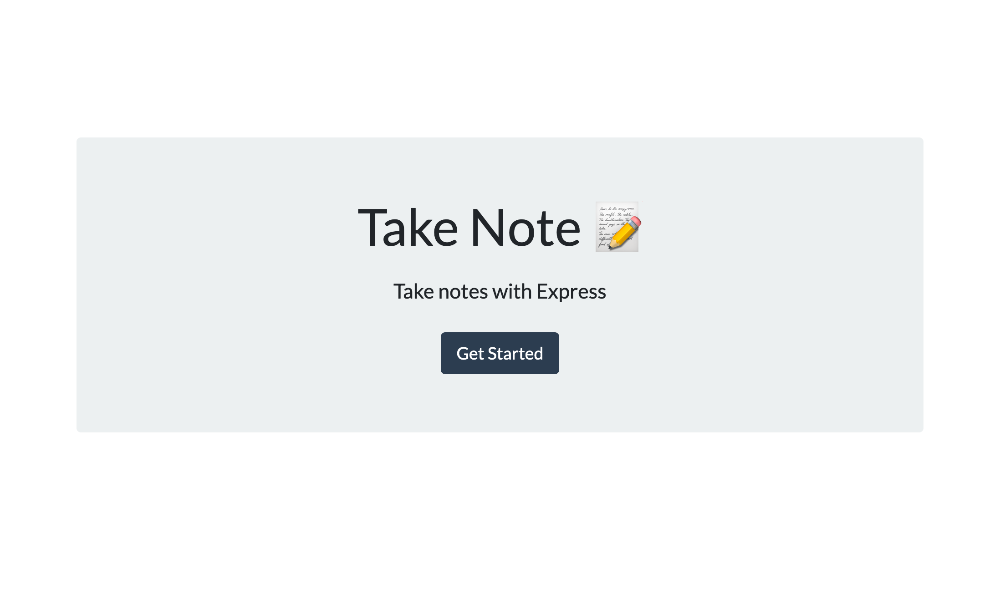
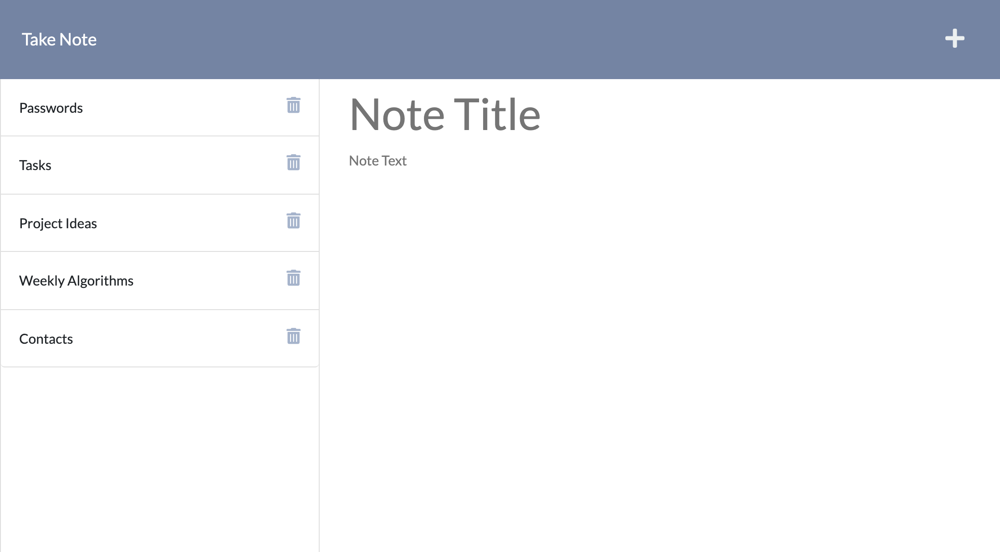

# Take Note 🗒️

## Description

Take Note is an application that allows users to write and save notes. Once saved, each note is displayed on the left-hand side of the webpage and stored and saved into a database, which means it can be accessed at anytime from any browser. View the deployed application [here](https://take-note-express.herokuapp.com/).




## User Story

```
AS A small business owner
I WANT to be able to write and save notes
SO THAT I can organize my thoughts and keep track of tasks I need to complete
```

## Acceptance Criteria

```
GIVEN a note-taking application
WHEN I open the Note Taker
THEN I am presented with a landing page with a link to a notes page
WHEN I click on the link to the notes page
THEN I am presented with a page with existing notes listed in the left-hand column, plus empty fields to enter a new note title and the note’s text in the right-hand column
WHEN I enter a new note title and the note’s text
THEN a Save icon appears in the navigation at the top of the page
WHEN I click on the Save icon
THEN the new note I have entered is saved and appears in the left-hand column with the other existing notes
WHEN I click on an existing note in the list in the left-hand column
THEN that note appears in the right-hand column
WHEN I click on the Write icon in the navigation at the top of the page
THEN I am presented with empty fields to enter a new note title and the note’s text in the right-hand column
```

## Technologies Used

- HTML
- CSS
- JavaScript
- jQuery
- Node.js
- Express.js
- UUID

## License

[](https://opensource.org/licenses/MIT)